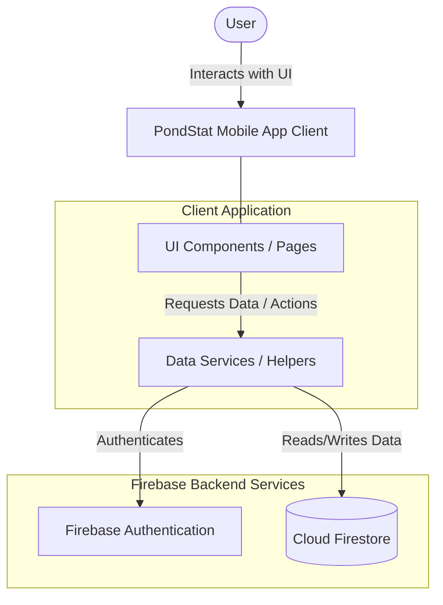

#PondStat-Mobile-App

### 1. Logical View Diagram

**Description:**
The PondStat system consists of a Flutter-based mobile client application and a serverless backend powered by Firebase. The user interacts directly with the **UI Components** (such as the login page or dashboards). These views communicate with the **Data Services** layer (like the Firestore helper) to process business logic. The service layer then communicates securely over the network with the **Firebase Backend Services** to authenticate users and manage pond statistics within the Cloud Firestore database.

---

### 2. Software Architecture Pattern

Based on the current structure, the system primarily follows a combination of the **Client-Server Architecture** and a **Layered (Presentation/Service) Pattern**.

* **Client-Server (Serverless Backend):** The PondStat Flutter app acts as the thick client handling the presentation and local logic, while Firebase acts as the backend server providing database (Firestore) and authentication services.
* **Layered Pattern (Presentation & Data Access):** Within the client codebase, the structure separates the user interface (Views/Pages) from the data interaction logic (Services/Helpers). This ensures that UI widgets are not heavily burdened with database query syntax, promoting cleaner and more maintainable code.

---

### 3. Project Structure

The following shows the project structure of the `lib/` directory and how the files equate to our identified architectural patterns.

* **`main.dart`** - Application Entry Point & Global Configurations

**Services & Data Access Layer (Client-Server / Backend Integration)**

* **`firestore_helper.dart`** - Manages CRUD operations and queries to Cloud Firestore
* **`firebase_options.dart`** - Auto-generated Firebase configuration bridging client and server
* **`auth_header.dart`** - Handles authentication state/tokens

**Presentation Layer / Views (UI Components)**

* **`welcome_page.dart`** - Initial landing screen
* **`login_page.dart`** - User authentication UI
* **`signup_page.dart`** - User registration UI
* **`default_dashboard.dart`** - Main view displaying summarized data to the user
* **`leader_dashboard.dart`** - Specialized dashboard view for team leaders
* **`no_pond_assigned.dart`** - Fallback UI state for users without linked data
* **`team_mgmt.dart`** - UI for managing team members

**Shared UI Components (Widgets)**

* **`getting_started_dialog.dart`** - Reusable onboarding modal
* **`loading_overlay.dart`** - Reusable loading state indicator
* **`profile_bottom_sheet.dart`** - Reusable profile action menu
